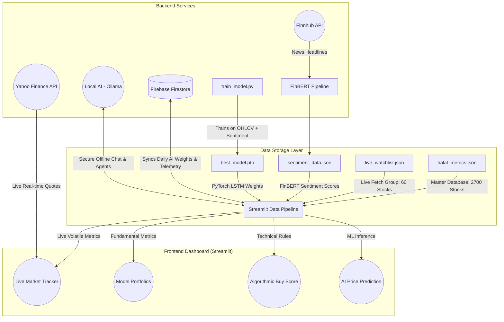

# Shareq Equities

**Institutional Shariah-Compliant Algorithmic Screener**

Shareq Equities is a modern, futuristic web dashboard built with Streamlit that tracks, analyzes, and provides AI-driven insights on the top 50+ Shariah-compliant Indian stocks. It features algorithmic buy scoring, dynamic portfolio generation, historical backtesting powered by Firebase, real-time news radar, and interactive technical charts.

---

## 🌟 Key Features

- **📊 Live Market Tracker:** Real-time tracking of Halal stocks with custom SVG Sparklines showing 30-day closing trends, Relative Strength Index (RSI), Simple Moving Average (SMA50), and 14-Day return metrics.
- **🧠 Algorithmic Buy Score:** A proprietary mathematical engine that evaluates stock momentum, MACD Crossovers, RSI, Bollinger Bands, and debt-to-equity ratios.
- **💼 Dynamic Model Portfolios:** A "Smart Waterfall Allocator" that takes your monthly SIP budget and dynamically builds Short-Term Momentum, Mid-Term Balanced, and Long-Term Compounder portfolios, calculating exact share quantities to buy without wasting a single rupee.
- **🤖 Local & Cloud AI Advisor:** Fully integrated with local Ollama LLMs (e.g., `qwen2.5-coder:3b-instruct`) for 100% private, offline financial analysis, with a fallback to Google's Gemini Pro.
- **🔮 ML Price Prediction (LSTM):** A fully integrated PyTorch machine learning pipeline that uses 30-day OHLCV history combined with NLP sentiment scoring to forecast next-day prices.
- **📰 FinBERT Sentiment Analysis:** Automatically fetches live news headlines from Finnhub and passes them through Hugging Face's `FinBERT` model to generate numerical sentiment signals (-1.0 to 1.0).
- **🗄️ Firebase Data Telemetry:** Secure, NoSQL data persistence that logs daily algorithmic snapshots to Firebase Firestore.
- **🎯 Real-World Backtesting:** The *Algo Accuracy* engine actively queries Firebase for predictions made exactly 30 days ago, comparing them to live prices today to calculate the algorithm's actual Win/Loss percentage.

---

## 🏗️ Application Blueprint (Architecture)

The application utilizes a **Centralized Static Database + Real-time Edge** architecture to ensure maximum performance while maintaining a massive encyclopedia of 2700+ Indian assets.



**Architecture Breakdown:**
1. **Master Database (`halal_metrics.json`):** Contains the fundamental data (Debt, Liquidity, Market Cap) for ~2700 stocks. This acts as the source of truth for Shariah-compliance and Company names.
2. **Live Watchlist (`live_watchlist.json`):** Contains the core ~60 tickers. The dashboard only actively queries `yfinance` for these specific stocks on page reload to ensure lightning-fast performance.
3. **Local AI Integration:** Connects to `localhost:11434` to keep all financial queries completely private without sending your portfolio data to external cloud providers.
4. **Machine Learning Pipeline:** Dedicated scripts (`ingest_sentiment.py` and `train_model.py`) process Finnhub news through Hugging Face's FinBERT, merge it with OHLCV data, and train a PyTorch LSTM model offline. The dashboard loads the `best_model.pth` weights for real-time predictions.

---

## 📖 How to Use the Application

### 1. The Core Modules
- **Tracker Tab:** View the live market. Stocks are scored from 0-100 based on algorithmic momentum.
- **Portfolios Tab (SIP Calculator):** Drag the "Monthly SIP Investment" slider. The engine will instantly recalculate exactly which stocks you should buy today, how many shares you can afford, and exactly how much uninvested cash will be leftover in your brokerage.
- **Advisor Tab:** Chat directly with the Local AI or Gemini. You can ask it to analyze a specific stock in the Master Database, and the dashboard will inject real-time context into the AI prompt so it knows exactly what the stock is doing.

### 2. Managing the Watchlist
You do not need to edit python code to add a new stock to your live tracking view.
- Simply open `live_watchlist.json`.
- Add a new ticker symbol (e.g. `"CRIZAC.NS": {"name": "Crizac Ltd", "sector": "Technology", "color": "#0ea5e9"}`).
- The dashboard will automatically begin fetching live real-time metrics for it on the next reload!

### 3. Setting up the AI Advisor
To unlock the Interactive Terminal, you can use either a Local AI (Private) or Cloud AI:

**Option A: Local AI (Recommended for Privacy)**
1. Install [Ollama](https://ollama.com/) on your local machine.
2. Ensure you have your `run.bat` script ready, or use the integrated `Start Local AI Module` button in the sidebar.
3. In the Dashboard sidebar, select **"Local AI"** as your engine.

**Option B: Google Gemini (Cloud)**
1. Obtain an API Key from [Google AI Studio](https://aistudio.google.com/).
2. Paste it into the Streamlit sidebar. The dashboard will securely cache it locally. *(Note: Never commit your `.env` or secrets files to GitHub!)*

### 4. Running the Machine Learning Pipeline
To enable the **ML Price Prediction** card in the Advanced Charts tab:
1. Export your Finnhub API Key: `set FINNHUB_API_KEY=your_key_here` (Windows) or `export FINNHUB_API_KEY=your_key_here` (Mac/Linux).
2. Run `python ingest_sentiment.py` to fetch recent news and score it with FinBERT.
3. Run `python train_model.py` to combine technicals + sentiment and train the PyTorch LSTM model. This creates `best_model.pth`.
4. Open the dashboard and navigate to Advanced Charts. The model will now predict next-day prices automatically.

---

## 🚀 Installation & Setup

### 1. Clone & Install
```bash
python -m venv venv
venv\Scripts\activate   # Windows
source venv/bin/activate # Mac/Linux
pip install -r requirements.txt
```

### 2. Firebase Configuration (Mandatory for Backtesting)
To enable historical data telemetry and real-world backtesting:
1. Create a [Firebase Project](https://console.firebase.google.com/) with a Firestore database.
2. Generate a Service Account JSON key from your project settings.
3. Rename the downloaded file to exactly `.firebase_key.json` and place it in the root directory.
> **⚠️ SECURITY WARNING:** The `.firebase_key.json` file contains highly sensitive cloud credentials. **Never commit this file to GitHub.** Ensure it is added to your `.gitignore`.

### 3. Run the Application
```bash
py -m streamlit run halal_dashboard.py
```

---

## ⚠️ Disclaimer
This project is for educational and informational purposes only. The "Algorithmic Buy Score", SIP Portfolios, and AI advice are simulated metrics and should not be considered professional financial advice. Always perform your own due diligence before making investment decisions.
